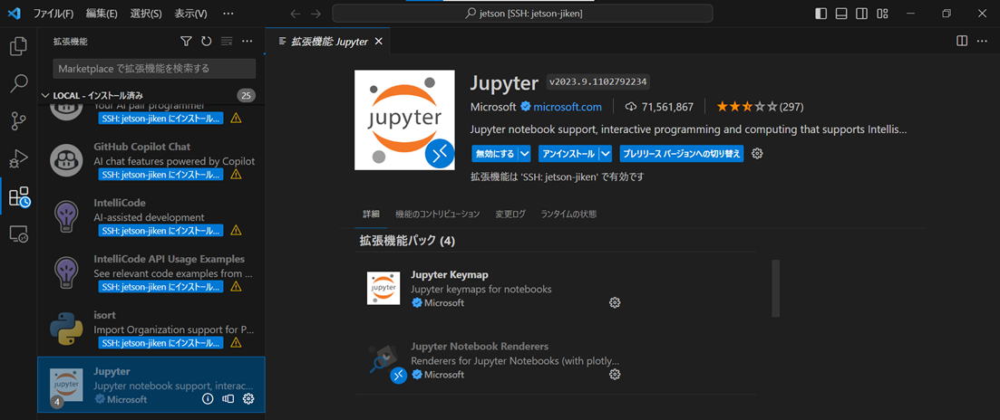

# VGG Model Demonstration

This repository provides tools for demonstration of VGG model in real time. You will need the weights of the VGG model learned at the [following link](https://github.com/ia-gu/jikken3_vision_recognition/tree/master).

## Table of Contents

1. [Setup](#setup)
2. [Usage](#usage)

## Setup 

Note. This is only for Jetson.


1. Clone this repository.

```bash
git clone [repository URL]
cd [repository name]
```

2. Install all packages.

```bash
bash setup.sh

#check
python test_camera.py
# genrerated 256x256 image as "./image.jpg"
```

3. (only VScode) Installing VScode's jupyter extension

    


4. (additonal) Correct the camera's color tone.

```bash

bash correct_color_tone.sh
```

## Usage

1. Place the pre-trained VGG model weights in an appropriate directory.

Jupyter notebook usage


2. Set the model and model weights path for demo.ipynb.


```bash
# default : weight_path = "final_weight.pth",model_var = "VGG11"
model_path = "[weight_path]"
model_var = "[VGG_ver]"

```

3. Run demo.ipynb

Python usage

2.  Set the model and model weights path for demo.py.

3.  Run demo.py

   ```bash
python3 demo.py
```


